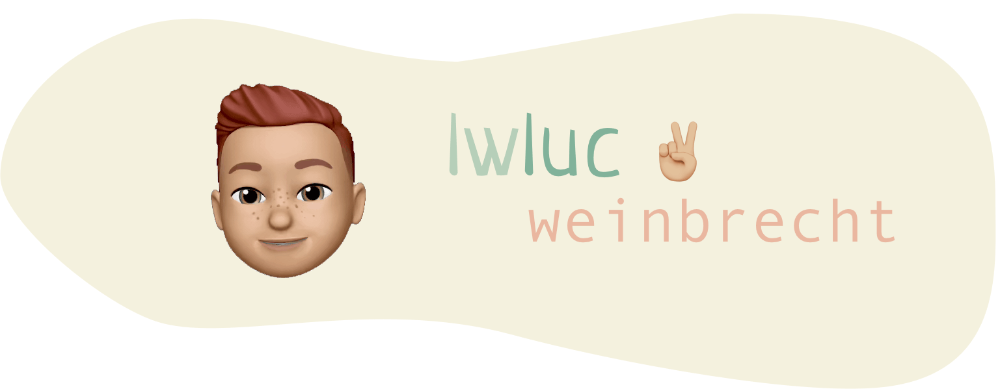

### Hi there 👋

My name is Luc Weinbrecht. Living and working as a Consultant in Karlsruhe 🏰. Find me on Twitter [🐦](https://twitter.com/lwluc).

## 🔧 Technologies & Tools 🔨

## 📈 GitHub Stats

  
  

